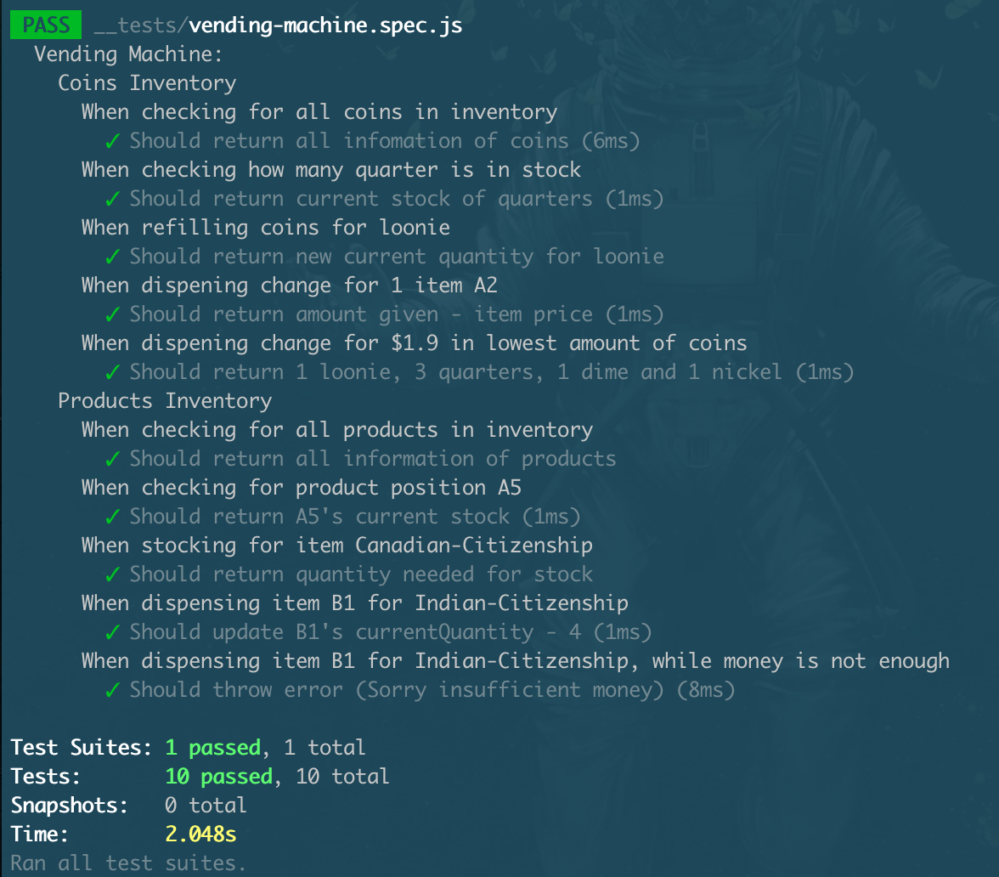

# Vending Machine Test (TDD)

## Description

This project is based on the questions you might be given as a develeper during an job interview. The purpose for TDD is to test out the associated functions, whether they are working properly and returning the expected value.

In my case, I created a vending machine along with 10 functions to test out that if my vending machine is working as expected or not.

## Functions

For Coins

- checkCoins()
- checkCoinStock()
- refillCoins()
- dispenseSum()
- dispenseChange()

For Products

- checkProducts()
- checkProductStock()
- restockProducts()
- setProductQuantity()
- dispenseProducts()

| For Coins:         | For Products:          |
| ------------------ | ---------------------- |
| - checkCoins()     | - checkProducts()      |
| - checkCoinStock() | - checkProductStock()  |
| - refillCoins()    | - restockProducts()    |
| - dispenseSum()    | - setProductQuantity() |
| - dispenseChange() | - dispenseProducts()   |
| ------------------ | ---------------------- |
